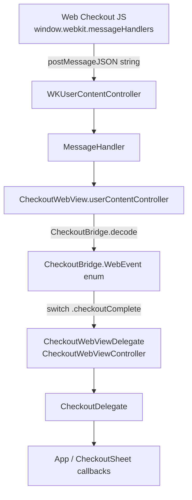

# Checkout Event Flow

This note walks through how the SDK turns a JavaScript bridge message into a strongly typed Swift event that the integrator can consume, starting at `CheckoutWebView.userContentController(_:didReceive:)`.

## Key Participants

- **Web checkout runtime**: Emits bridge messages such as `"completed"` via `window.webkit.messageHandlers.EmbeddedCheckoutProtocolConsumer.postMessage(payload)`.
- `MessageHandler` (`Sources/ShopifyCheckoutSheetKit/MessageHandler.swift`): Lightweight proxy that keeps `CheckoutWebView` as the `WKScriptMessageHandler` while avoiding retain cycles.
- `CheckoutWebView` (`CheckoutWebView.swift`): Subclasses `WKWebView`, attaches the message handler in `connectBridge()`, and implements the decoding switch inside `userContentController(_:didReceive:)`.
- `CheckoutBridge` (`CheckoutBridge.swift`): Shared helper for decoding incoming JSON strings into the `WebEvent` enum and for dispatching outgoing messages back to the page.
- `CheckoutWebViewController` (`CheckoutWebViewController.swift`): Acts as the `CheckoutWebViewDelegate`; translates web events into higher-level checkout lifecycle callbacks.
- `CheckoutDelegate` (`CheckoutDelegate.swift`): Public protocol exposed to host apps; default implementation supplied by `CheckoutDelegateWrapper` when using the SwiftUI `CheckoutSheet`.

## Event Decoding and Delivery

1. **Bridge attachment** – When a `CheckoutWebView` is created, `connectBridge()` registers a `MessageHandler` for the `EmbeddedCheckoutProtocolConsumer` message channel on the web view’s `WKUserContentController`.
2. **Message emission** – Web checkout JavaScript posts a UTF-8 JSON string describing an event (for example, `{"name": "completed", "body": "{...}"}`).
3. **Forwarding into Swift** – `MessageHandler.userContentController(_:didReceive:)` forwards the message to the `CheckoutWebView` instance.
4. **Decoding** – Inside `CheckoutWebView.userContentController`, the payload is parsed via `CheckoutBridge.decode(_:)`, yielding a `CheckoutBridge.WebEvent`.
   - For a `"completed"` event, `CheckoutCompletedEventDecoder` reads the embedded JSON body and creates a strongly typed `CheckoutCompletedEvent`.
5. **View delegate callback** – `CheckoutWebView` switches on the decoded `WebEvent` case and invokes `viewDelegate?.checkoutViewDidCompleteCheckout(event:)`.
6. **Controller hand-off** – `CheckoutWebViewController`, acting as the view delegate, handles UI side effects (confetti, cache management) and forwards the event to its `delegate` through `delegate?.checkoutDidComplete(event:)`.
7. **Consumer delivery** – The host app implements `CheckoutDelegate` (or configures the SwiftUI `CheckoutSheet` closures inside `CheckoutDelegateWrapper`) to receive the final, fully decoded `CheckoutCompletedEvent`.

## Flow Diagram

## Class & Protocol Hierarchy Snapshot

- `CheckoutWebView` ⟶ conforms to `WKScriptMessageHandler`, holds a `CheckoutWebViewDelegate`.
- `CheckoutWebViewController` ⟶ implements `CheckoutWebViewDelegate`, exposes a `CheckoutDelegate`.
- `CheckoutViewController` ⟶ embeds `CheckoutWebViewController` inside a `UINavigationController`.
- `CheckoutSheet` (SwiftUI) ⟶ wraps `CheckoutViewController` and injects a `CheckoutDelegateWrapper`, mapping delegate callbacks to closure properties for SwiftUI consumers.

Together, these layers ensure that every bridge event is validated, decoded, and surfaced to the application in a single, well-defined protocol callback.
