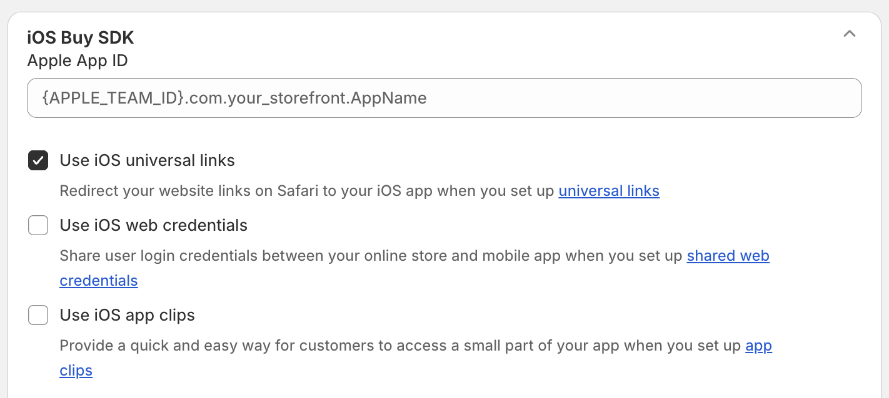

# Universal Links

- [Universal Links](#universal-links)
  - [What are Universal Links?](#what-are-universal-links)
  - [Setting Up an Entitlements File for Universal Links](#setting-up-an-entitlements-file-for-universal-links)
    - [Steps to Configure the Entitlements File](#steps-to-configure-the-entitlements-file)
    - [Points to Consider](#points-to-consider)
  - [Configuring Universal Links for your Storefront](#configuring-universal-links-for-your-storefront)
  - [Important: The catch-all route `*`](#important-the-catch-all-route-)
  - [Handling Universal Links in your app](#handling-universal-links-in-your-app)
  - [Security Considerations](#security-considerations)
  - [Testing](#testing)
  - [Troubleshooting](#troubleshooting)
  - [Further Reading and Resources](#further-reading-and-resources)

## What are Universal Links?

Universal Links are an iOS feature which allow apps to open links directly in an app rather than sending the user to a browser. This feature provides a seamless user experience by directly engaging app users with relevant content.

## Setting Up an Entitlements File for Universal Links

To enable Universal Links in your iOS app, you'll need to configure an entitlements file that specifies the associated domains your app is allowed to handle. Here’s how you can set it up:

### Steps to Configure the Entitlements File

1. **Open Your Xcode Project**:

   - Launch Xcode and open your project or workspace file.

2. **Navigate to Your App Target's Capabilities**:

   - Click on your project in the Project Navigator.
   - Select your app target from the list of targets.
   - Click on the "Capabilities" tab at the top of the editor.

3. **Enable Associated Domains**:

   - In the Capabilities section, find "Associated Domains" and toggle the switch to enable it.
   - A new section should appear to configure your associated domains.

4. **Add Your Associated Domains**:

   - Add each domain you want to associate with your app in the format: `applinks:yourdomain.com`
     - For example, `applinks:example.com` if your domain is `example.com`.

5. **Verify the Entitlements File**:

   - Xcode will automatically add an entitlements file to your project if it doesn't exist, or update your existing one. You can verify this by checking for a file named `YourApp.entitlements` in your project.
   - Open this file to ensure the associated domains are listed correctly under the `<key>com.apple.developer.associated-domains</key>` entry.

6. **Build and Run Your App**:
   - Make sure your app's provisioning profile includes support for the associated domains capability.
   - Build and run your app on a device to test the setup.

### Points to Consider

- **HTTPS Requirement**: Ensure all of your associated domains are served over HTTPS.
- **Multiple Domains**: You can list multiple associated domains by adding each one on a new line in the Associated Domains section within Xcode.
- **Testing**: After setting up, test your Universal Links by opening valid URLs on a device to ensure they correctly redirect to your app.

> [!IMPORTANT]
>
> `.well-known/apple-app-site-association` files will **not** be served from "\*.myshopify.com" domains.
> You must connect a non-myshopify domain under https://admin.shopify.com/settings/domains to serve these files.

## Configuring Universal Links for your Storefront



- Start by navigating to your storefront's Admin panel at https://admin.shopify.com/settings/apps/development.
- If an app is already set up, select the appropriate one. If not, proceed to create a new app.
- Within your app's "Configuration" tab, click "Edit" on the "Storefront API" section.
- In the "iOS Buy SDK" section, enter your Apple App ID, activate "Use iOS Universal Links," and upload your Apple app certificate.

> [!NOTE]
> Your Apple app certificate will ensure the integrity of your apple-app-site-association file.

The result of configuring Universal Links for your store will be a `.well-known/apple-app-site-association` JSON file served from your public storefront domain. This file informs iOS about the routes that should open directly in your app instead of in a web browser. Apple will periodically fetch this file to configure app routing on buyer's devices. This process is essential for ensuring a seamless app experience when users navigate URLs associated with your app.

```json
{
  "applinks": {
    "apps": [],
    "details": [
      {
        "appID": "{APPLE_TEAM_ID}.{BUNDLE_IDENTIFIER}",
        "paths": [
          "NOT /admin/*",
          "NOT /*/amazon_payments/callback",
          "NOT /*/checkouts/*/express/callback",
          "/*"
        ]
      }
    ]
  }
}
```

## Important: The catch-all route `*`

The /\* catch-all route in the configuration indicates that iOS should open any URL from your domain in your app, except for those paths specifically excluded by "NOT" rules.

- **Exclusions**: URLs like admin paths and payment callbacks are excluded by "NOT" rules to prevent them from opening in the app.
- **Email Links**: Links in emails, such as abandoned carts, will open in your app when clicked.
- **Shared Links**: General web links from your domain will open in your app unless they're specifically excluded.
- **Webview Links**: Links opened in a webview won't trigger the app unless it's set up to support them.
- **Excluded Paths**: URLs like /admin/\* and payment callbacks will open outside the app as specified.

---

## Handling Universal Links in your app

```swift
func handleUniversalLink(url: URL) {
  let storefrontUrl = StorefrontURL(from: url)

  switch true {
  /// Checkout URLs
  case storefrontUrl.isCheckout() && !storefrontUrl.isThankYouPage():
      presentCheckout(url)
  /// Cart URLs
  case storefrontUrl.isCart():
      navigateToCart()
  /// Open everything else in Safari
  default:
      if UIApplication.shared.canOpenURL(url) {
        UIApplication.shared.open(url)
      }
  }
}

// This code is meant as example only.
public struct StorefrontURL {
    public let url: URL

    init(from url: URL) {
        self.url = url
    }

    public func isThankYouPage() -> Bool {
        return url.path.range(of: "/thank[-_]you", options: .regularExpression) != nil
    }

    public func isCheckout() -> Bool {
        return url.path.contains("/checkout")
    }

    public func isCart() -> Bool {
        return url.path.contains("/cart")
    }
}
```

<details>
<summary><strong>Handling Universal Links in SwiftUI</strong></summary>

To handle universal links in a SwiftUI application, you can use the `onOpenURL` modifier provided by SwiftUI. This will allow you to specify an action to perform when a URL is opened by your app.

```swift
// App.swift
import SwiftUI

@main
struct MyApp: App {
    var body: some Scene {
        WindowGroup {
            ContentView()
                .onOpenURL { url in
                    handleUniversalLink(url: url)
                }
        }
    }

    private func handleUniversalLink(url: URL) {
        // Handle the incoming universal link URL
        print("Universal link opened: \(url)")

        // Use the URL to navigate within your app, update state, etc.
    }
}
```

</details>

<details>
<summary><strong>Handling Universal Links in a UIViewController-based App</strong></summary>

In an app using UIViewController, handling universal links can be done by implementing the application`(_:continue:restorationHandler:)` method in your `AppDelegate`. This method gets triggered when a universal link is opened.

```swift
// AppDelegate.swift
import UIKit

@UIApplicationMain
class AppDelegate: UIResponder, UIApplicationDelegate {

    var window: UIWindow?

    func application(_ application: UIApplication, continue userActivity: NSUserActivity, restorationHandler: @escaping ([UIUserActivityRestoring]?) -> Void) -> Bool {
        if userActivity.activityType == NSUserActivityTypeBrowsingWeb,
           let url = userActivity.webpageURL {
            handleUniversalLink(url: url)
            return true
        }
        return false
    }

    private func handleUniversalLink(url: URL) {
        // Handle the incoming universal link URL
        print("Universal link opened: \(url)")

        // You can use the URL to navigate within your app or perform relevant actions
        let rootViewController = window?.rootViewController as? UINavigationController

        // Replace the following content with relevant actions for your app
        let storyboard = UIStoryboard(name: "Main", bundle: nil)
        let viewController = storyboard.instantiateViewController(withIdentifier: "DetailViewController")
        rootViewController?.pushViewController(viewController, animated: true)
    }
}
```

</details>

## Security Considerations

- **Data Privacy**:

  - Universal Links can pass sensitive information through URLs. Ensure any personal or sensitive data is encrypted or tokenized to protect user privacy.

- **URL Handling**:

  - Rigorously validate and sanitize any data received from Universal Links to prevent URL injection attacks. Only allow expected URL formats and handle unexpected URLs gracefully.

- **App Update and Expiry**:

  - Keep your app updated to handle links correctly, and ensure that any links requiring special app capabilities are managed. If a link cannot be handled by the currently installed app, consider providing users with a fallback option or gracefully notifying them.

- **Testing and Monitoring**:

  - Regularly test the functionality of Universal Links to ensure they are correctly pointing to your app and not opening other apps or browsers with potentially harmful content.
  - Monitor your app for any attempts at misuse or abuse of links.

- **Certificate Management**:

  - Maintain secure and appropriate certificate management practices for your app to prevent unauthorized access or configuration changes related to Universal Links.

## Testing

With Universal Links set up, you can test the implementation in the simulator by triggering URLs manually with:

```sh
xcrun simctl openurl booted https://www.example.com/cart
```

## Troubleshooting

1. Ensure Associated Domains:

Verify that your app's entitlements file includes the correct associated domains.

Ensure that the `.well-known/apple-app-site-association` file is accessible by going to "https://{your_storefront_domain}/.well-known/apple-app-site-association". Remember that this file will only be accesible on a custom hosted domain, and not a "*.myshopify.com" domain.


2. Universal Links Diagnostics

See https://developer.apple.com/documentation/technotes/tn3155-debugging-universal-links#Test-universal-links-behavior for more information regarding testing Universal Links.


## Further Reading and Resources

For more comprehensive information, consider visiting:

- [Apple's Official Universal Links Documentation](https://developer.apple.com/documentation/xcode/supporting-universal-links-in-your-app)
